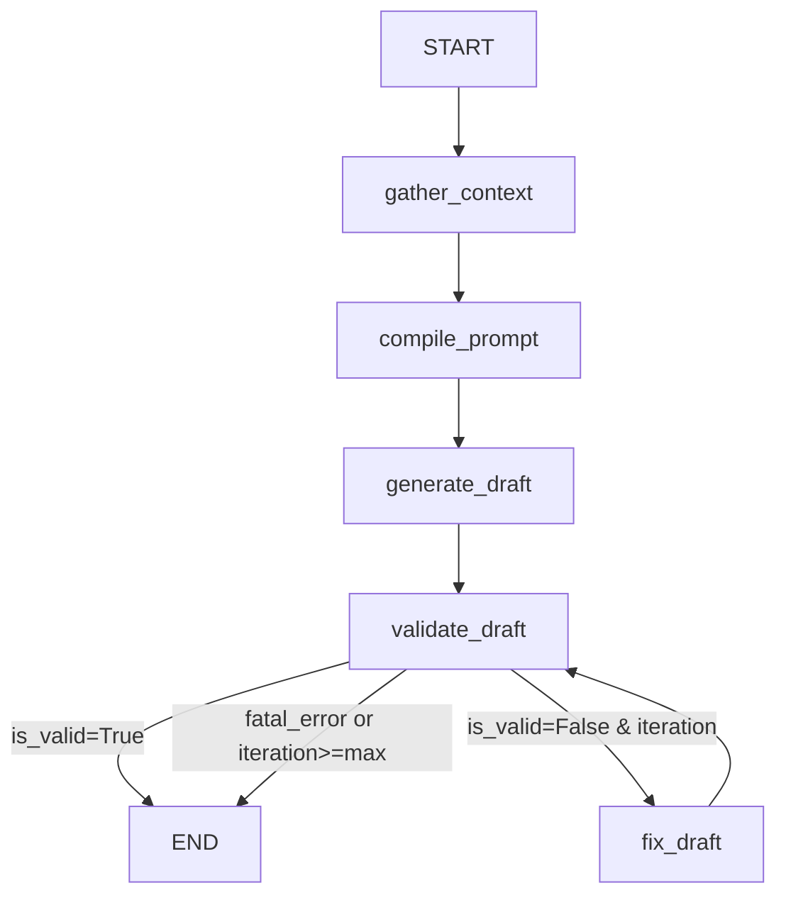
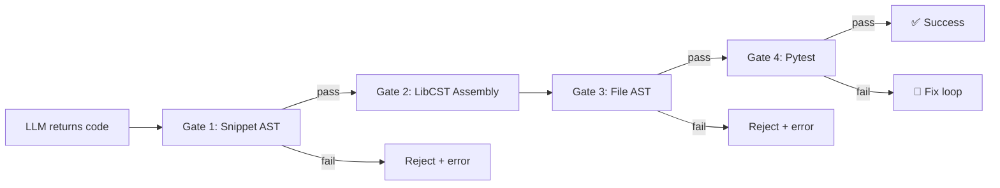

<div align="center">

# 🐺 Orka

**The Autonomous Code Surgery Engine for Python**

Refactor, test, and transplant code with surgical precision — powered by AST analysis, LibCST patching, and LLM backends.

[]()
[](https://www.python.org/downloads/)
[](LICENSE)

[Installation](#installation) · [Quick Start](#quick-start) · [Commands](#commands) · [Configuration](#configuration) · [Architecture](#architecture)

</div>

---

Orka is built for autonomous coding agents and orchestrators that need to modify Python codebases reliably at scale. By operating on Abstract Syntax Trees (AST) via LibCST instead of relying on fragile string replacement or regex, Orka eliminates the cascading syntax errors that cost agents thousands of dollars in wasted LLM tokens. It builds a semantic dependency graph and vector index of your project, then uses that context to perform precise, unattended code modifications — refactoring methods, generating tests, or extracting classes — all night long without human intervention.

## ✨ Key Features

- **AST-First, Not String Replacement** — Operates on the syntax tree directly, saving thousands of dollars in wasted LLM tokens by avoiding the cascading syntax errors typical of regex-based patching
- **Semantic Code Graph** — AST-powered dependency graph with ChromaDB vector search, giving agents the deep context needed to make correct edits unattended
- **Surgical Refactoring** — LLM-synthesized method bodies patched via LibCST; your formatting, comments, and surrounding code stay intact
- **Intelligent Test Generation** — Generates pytest tests with full awareness of dependencies, signatures, and call graph constraints
- **Class Extraction** — Move a class to a new file and automatically heal all imports across the project
- **4-Gate Validation** — Every LLM output passes through snippet AST → assembly → file AST → pytest before being written to disk, ensuring autonomous loops don't brick your codebase
- **Multi-Provider LLM** — First-class support for Together AI, OpenAI, DeepSeek, Gemini, Anthropic, Groq, OpenRouter, and any OpenAI-compatible endpoint
- **Composable Prompts** — Template + rule system with a three-tier override hierarchy (builtin → project → CLI)

## Installation

Orka is a global CLI tool — install it once on your system, then run it inside any Python project. It does not need to be installed in your project's virtual environment.

### Recommended: Install from Git (pin to a release)

Orka is currently in Alpha and not yet on PyPI. Install it globally from the repository, pinning to a specific tag or commit hash to avoid breaking changes:

```bash
# Pin to a specific release tag
pip install git+https://github.com/your-org/orka.git@v0.1.0

# Or pin to a specific commit hash
pip install git+https://github.com/your-org/orka.git@a1b2c3d
```

### Alternative: Editable install (for contributors)

If you're contributing to Orka itself, clone and install in editable mode:

```bash
git clone https://github.com/your-org/orka.git
pip install -e /path/to/cloned/orka
```

### Verify your installation

Once installed globally, the `orka` command is available everywhere. Navigate to any Python project you want to work on. Orka uses your current working directory to locate the project's `.env`, `.orka/` configuration, and source code.

```bash
cd /path/to/your/project
orka doctor  # Verify setup and API connectivity
```

### Security hooks (contributors)

Orka ships with a pre-push git hook that scans outgoing commits for leaked secrets using [Gitleaks](https://github.com/gitleaks/gitleaks). If a potential secret is detected, the push is blocked.

```bash
make hooks
```

This sets your local repo's hooks path to `.githooks/`. You'll also need [Gitleaks](https://github.com/gitleaks/gitleaks) installed — `make hooks` will download it into your venv automatically if it's not found.

To bypass the hook once (e.g. for a known false positive):

```bash
git push --no-verify
```

You can also run a full security audit at any time:

```bash
make security
```

## Quick Start

1. **Navigate to your project** and initialize Orka (creates `.env`, `.orka/`, and editor rules):

   ```bash
   cd /path/to/your/project
   orka init
   ```

2. **Set your API key** in `.env`:

   ```env
   ORKA_DEFAULT_PROVIDER=together_ai
   TOGETHER_API_KEY=tgp_...
   ```

3. **Scan your codebase** (builds the dependency graph + vector index):

   ```bash
   orka scan
   ```

4. **Refactor a method**:

   ```bash
   orka refactor --file src/payments.py --cls PaymentService --method process --req "Add retry logic with exponential backoff"
   ```

5. **Generate tests**:

   ```bash
   orka testgen --file src/payments.py --cls PaymentService --method process --run
   ```

## Commands

| Command | Description |
|---------|-------------|
| `orka init` | Initialize Orka in your project (`.env`, `.orka/`, editor rules) |
| `orka scan` | Scan codebase, build dependency graph and vector index |
| `orka inspect --id <node>` | Inspect a graph node and its connections |
| `orka refactor` | Surgically refactor a method body using AI |
| `orka testgen` | Generate pytest tests for a method or function |
| `orka extract` | Extract a class into a new file, auto-healing imports |
| `orka prompt` | Compile and display a prompt (no LLM call) |
| `orka doctor` | Diagnose configuration and project health |

### `orka refactor`

```bash
orka refactor --file src/service.py --cls MyService --method handle --req "Add input validation"
```

| Flag | Description |
|------|-------------|
| `--file` | Source file path |
| `--cls` | Class name (omit for standalone functions) |
| `--func` | Alias for `--cls` (mutually exclusive) |
| `--method` | Method or function name to refactor |
| `--req` | Business requirements for the new logic |
| `--dry-run` | Preview changes without modifying the file |
| `--json` | Output structured JSON |
| `--provider` | LLM provider override |

### `orka testgen`

```bash
orka testgen --file src/service.py --cls MyService --method handle --run
```

| Flag | Description |
|------|-------------|
| `--file` | Source file path |
| `--cls` | Class name (omit for standalone functions) |
| `--func` | Alias for `--cls` (mutually exclusive) |
| `--method` | Method or function name |
| `--output` | Write tests to this file (omit for stdout) |
| `--run` | Execute pytest after writing |
| `--n` | Generate N test rounds (appending to output) |
| `--dry-run` | Preview without writing |
| `--json` | Output structured JSON |
| `--provider` | LLM provider override |

### `orka extract`

```bash
orka extract --file src/utils.py --cls DataParser --dest src/parsers.py
```

Moves `DataParser` to `src/parsers.py` and updates all imports project-wide.

## Configuration

Orka loads configuration from a `.env` file in your project root. Everything is optional — set your API key and go.

### Minimal setup

```env
ORKA_DEFAULT_PROVIDER=together_ai
TOGETHER_API_KEY=tgp_...
```

### Model tiers

Orka uses three model tiers for different tasks:

| Tier | Purpose | Fallback |
|------|---------|----------|
| `smart` | Architecture, planning, complex reasoning | Provider default |
| `fast` | Summarisation, simple edits, HyDE queries | Falls back to `smart` |
| `edit` | Surgical code transformations | Falls back to `smart` |

Each tier resolves in this order:

1. **Explicit override** — `ORKA_SMART_MODEL`, `ORKA_FAST_MODEL`, `ORKA_EDIT_MODEL`
2. **Provider-specific** — `TOGETHER_MODEL`, `DEEPSEEK_MODEL`, etc. (active provider only)
3. **Built-in default** — sensible default for the chosen provider

```env
ORKA_SMART_MODEL=gpt-4o
ORKA_FAST_MODEL=gpt-4o-mini
```

### Supported providers

| Provider | Key env var | API base env var |
|----------|-------------|------------------|
| Together AI | `TOGETHER_API_KEY` | — |
| OpenAI | `OPENAI_API_KEY` | `OPENAI_API_BASE` |
| DeepSeek | `DEEPSEEK_API_KEY` | `DEEPSEEK_API_BASE` |
| Google Gemini | `GEMINI_API_KEY` | — |
| Anthropic | `ANTHROPIC_API_KEY` | — |
| OpenRouter | `OPENROUTER_API_KEY` | `API_BASE` |
| Groq | `GROQ_API_KEY` | `API_BASE` |
| Generic OpenAI-compat | `API_KEY` | `API_BASE` |

### Common settings

| Setting | Env var | Default | Description |
|---------|---------|---------|-------------|
| Default provider | `ORKA_DEFAULT_PROVIDER` | `together_ai` | LLM provider |
| Temperature | `ORKA_TEMPERATURE` | `0.1` | LLM temperature |
| Timeout | `ORKA_TIMEOUT` | `120` | API timeout (seconds) |
| Max retries | `ORKA_MAX_RETRIES` | `3` | API retry count |
| Verify SSL | `ORKA_VERIFY_SSL` | `True` | SSL verification |
| Dry run | `ORKA_DRY_RUN` | `False` | Global dry-run mode |
| Verbose | `ORKA_VERBOSE` | `False` | Verbose logging |

See [`example.env`](example.env) for the full reference.

## Architecture

Orka runs a deterministic **LangGraph state machine** with exactly two LLM-invoking nodes (generator and fixer). 

### Surgery Pipeline

The core loop ensures autonomous agents don't get stuck in infinite error cycles. If validation fails and iterations remain, a fixer node sends the error context back to the LLM for correction. If all iterations are exhausted, the file is rolled back to its original state.



### 4-Gate Validation

Every LLM output passes through a strict 4-gate validation pipeline before touching disk. This AST-first approach is what saves thousands of dollars in wasted LLM tokens by catching syntax errors before they cascade.



The prompt system uses composable `%%variable%%` templates with a three-tier rule override hierarchy (builtin → project → CLI) and automatic context budgeting.

For the full architecture reference, see [docs/ARCHITECTURE.md](docs/ARCHITECTURE.md).

## LLM-Native Documentation

Orka provides structured documentation optimized for LLMs and autonomous coding agents:

- **[llms.txt](llms.txt)** — Concise project index for fast context loading.
- **[llms-full.txt](llms-full.txt)** — Full concatenated context (Architecture + Flow Control).
- **[AGENTS.md](AGENTS.md)** — Operational guardrails and instructions for AI agents.

## Project Status

Orka is currently in **Alpha**. The CLI interface, configuration keys, and internal APIs may change between releases without a deprecation period. We recommend pinning to a specific commit hash if you're integrating Orka into an autonomous pipeline.

Feedback and bug reports are welcome — this is the phase where real-world usage shapes the product.

---

## Security

Orka is scanned regularly with:

- **Bandit** — Python static security analysis
- **TruffleHog** — git history secret leak detection
- **pip-audit** — supply chain vulnerability audit

See [docs/SECURITY_AUDIT.md](docs/SECURITY_AUDIT.md) for the latest full report and re-run instructions.

---

## License

MIT


