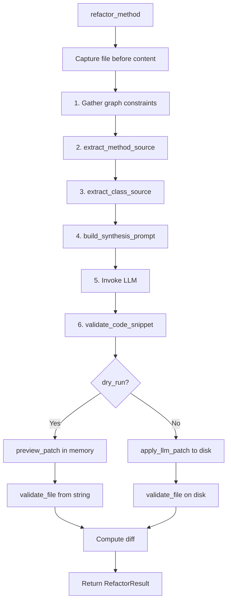
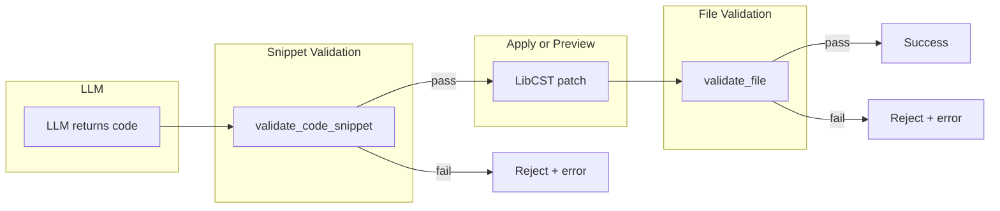
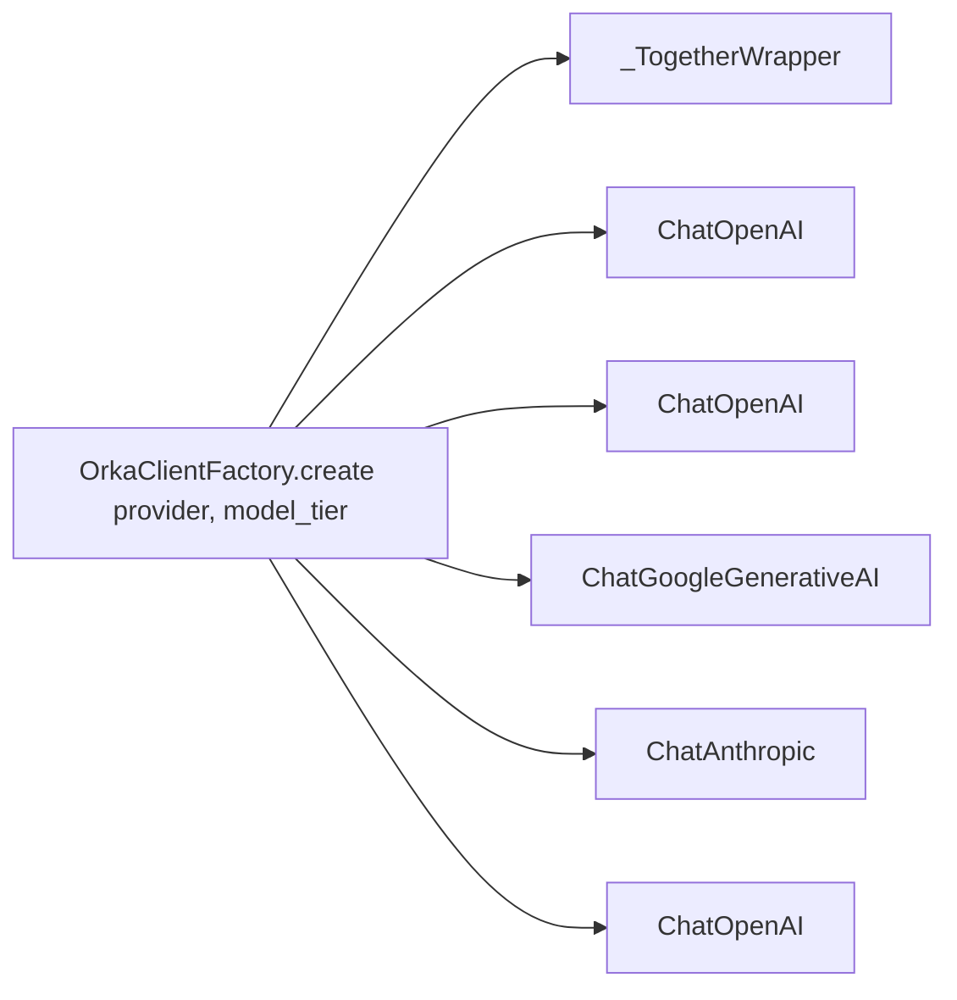

# Orka Architecture

> Canonical reference for the Orka code surgery toolkit. Designed to be
> ingested by LLM coding assistants for accurate operations on the codebase.

## Package Layout

```text
orka/
  pyproject.toml
  README.md
  docs/
    ARCHITECTURE.md   (this file)
    ROADMAP.md
    checkpoints/      (implementation checkpoints)
  orka/               (installable package)
    __init__.py
    cli.py            (Typer CLI)
    config.py         (dotenv settings, CWD-based)
    clients.py        (Together AI + DeepSeek LLM clients)
    orchestrator.py   (scan + refactor pipeline)
    core/
      __init__.py
      validator.py    (ast.parse validation: snippet + file)
      cascade.py      (import cascade after class extraction)
      ingester.py     (NetworkX graph DB + AST visitor)
      vector_store.py (ChromaDB embeddings)
    surgery/
      __init__.py
      analyzer.py     (dependency scope analysis)
      modifier.py     (LibCST method body replacement + preview_patch)
      synthesizer.py  (LLM prompt construction + source extraction)
      transplanter.py (class extraction + import healing)
    tests/
      test_validator.py
      test_standalone_function.py
      test_refactor_result.py
      test_modifier.py
      test_orchestrator.py
      ...
```

## Entry Points

| Command | Module chain | Description |
|---------|-------------|-------------|
| `orka scan` | `cli.py` | Build dependency graph + vector DB |
| `orka inspect --id` | `cli.py` | Query graph node neighbors |
| `orka extract --file --cls --dest` | `cli.py` -> `transplanter.py` -> `cascade.py` | Move class, heal imports |
| `orka refactor --file --method --req [--cls] [--json] [--dry-run]` | `cli.py` -> `orchestrator.py` -> `modifier.py` | LLM-synthesize method body |

## Refactoring Pipeline



## New CLI Flags (Phase 2)

| Flag | Command | Description |
|------|---------|-------------|
| `--cls` | `refactor` | Class name (optional -- omit for standalone functions) |
| `--func` | `refactor` | Alias for `--cls` (mutually exclusive, semantic for non-class) |
| `--method` | `refactor` | Method or function name to refactor |
| `--req` | `refactor` | Business requirements for the new logic |
| `--json` | `refactor` | Output structured JSON instead of text |
| `--dry-run` | `refactor` | Preview changes without modifying file (implies `--json`) |
| `--provider` | `refactor`, `init` | LLM provider override |

## Structured Output

When `--json` or `--dry-run` is used, `orka refactor` emits a single JSON line
matching the `RefactorResult` dataclass:

```json
{"success": true, "label": "MyClass.my_method", "file": "/abs/path.py", "diff": "--- ...", "dry_run": false}
{"success": false, "label": "my_function", "file": "/abs/path.py", "error": "Syntax error ...", "dry_run": true}
```

## Two-Gate Validation



Both gates use `ast.parse()`. The snippet gate wraps bare statements in a dummy
function so that `return x`, `raise`, etc. parse correctly.

## Key Dependencies

| Library | Purpose |
|---------|---------|
| `typer` | CLI framework |
| `rich` | Terminal output |
| `python-dotenv` | Environment loading |
| `libcst` | Syntax-safe code transformations |
| `networkx` | Dependency graph |
| `chromadb` | Semantic vector search |
| `together` | Together AI SDK (native) |
| `langchain-openai` | OpenAI / DeepSeek / OpenAI-compatible providers |
| `langchain-google-genai` | Google Gemini (optional) |
| `langchain-anthropic` | Anthropic Claude (optional) |

## Configuration

- `.env` in the current working directory is loaded at import time.
- `ORKA_ENV_FILE` overrides the `.env` path.
- API keys use standard names (`OPENAI_API_KEY`, `TOGETHER_API_KEY`, etc.).
- Three model tiers: `smart`, `fast`, `edit` (see `example.env` for full docs).

### Supported providers

| Provider | LangChain backend | Key env var |
|----------|-------------------|-------------|
| OpenAI | `ChatOpenAI` | `OPENAI_API_KEY` |
| DeepSeek | `ChatOpenAI` | `DEEPSEEK_API_KEY` |
| Together AI | Together SDK (native wrapper) | `TOGETHER_API_KEY` |
| Google Gemini | `ChatGoogleGenerativeAI` | `GEMINI_API_KEY` |
| Anthropic | `ChatAnthropic` | `ANTHROPIC_API_KEY` |
| OpenRouter | `ChatOpenAI` | `OPENROUTER_API_KEY` |
| Groq | `ChatOpenAI` | `GROQ_API_KEY` |
| Generic OpenAI-compat | `ChatOpenAI` | `API_KEY` |

### Client architecture



Every path returns an object obeying `.invoke(messages) -> AIMessage`.
Callers never know which SDK is underneath.
