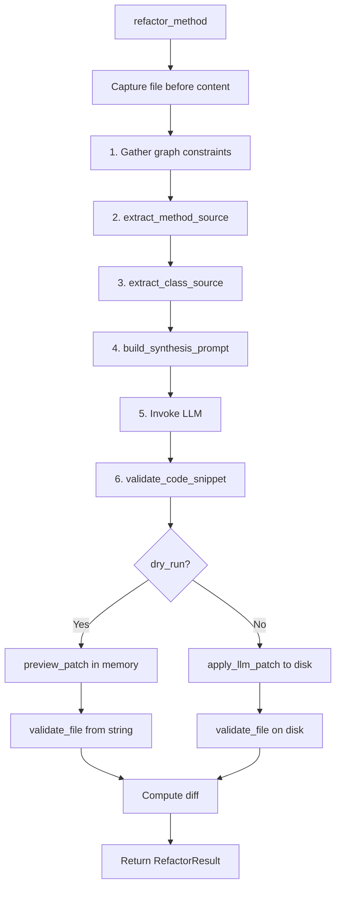
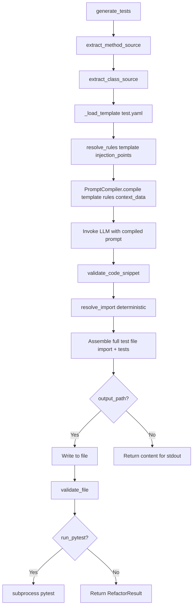
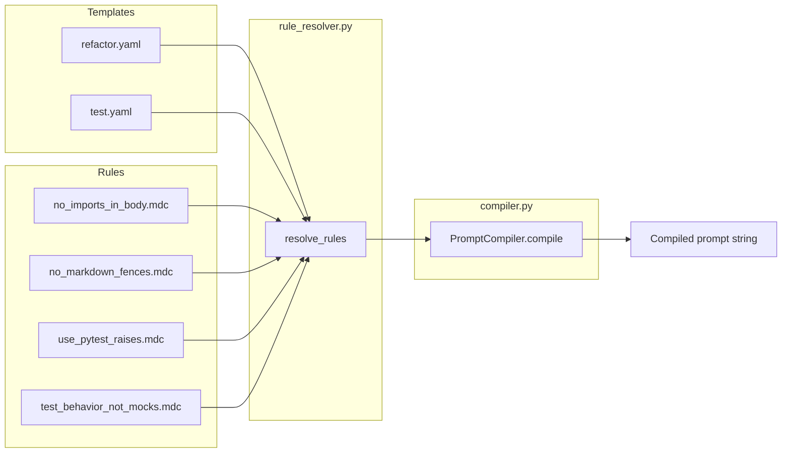
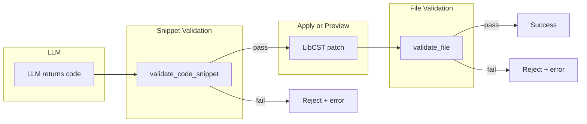
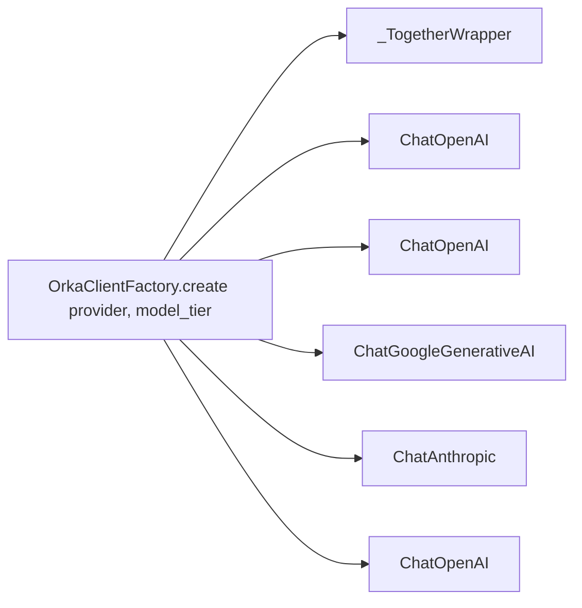

# Orka Architecture

> Canonical reference for the Orka code surgery toolkit. Designed to be
> ingested by LLM coding assistants for accurate operations on the codebase.

## Package Layout

```text
orka/
  pyproject.toml
  README.md
  docs/
    ARCHITECTURE.md   (this file)
    ROADMAP.md
    checkpoints/      (implementation checkpoints)
  orka/               (installable package)
    __init__.py
    cli.py            (Typer CLI)
    config.py         (dotenv settings, CWD-based)
    clients.py        (Together AI + DeepSeek LLM clients)
    orchestrator.py   (scan + refactor pipeline)
    core/
      __init__.py
      validator.py    (ast.parse validation: snippet + file)
      cascade.py          (import cascade after class extraction)
      ingester.py         (NetworkX graph DB + AST visitor)
      vector_store.py     (ChromaDB embeddings)
      compiler.py         (Jinja2 prompt compiler with context budgeting)
      templates.py        (Pydantic schemas: PromptTemplate, InjectionRule, OutputType)
      rule_resolver.py    (.mdc rule parser + three-tier resolution)
      import_fixer.py     (Deterministic import generation for test files)
      init_helper.py      (One-time init: .env, .orka/, Continue.dev rules)
    surgery/
      __init__.py
      analyzer.py     (dependency scope analysis)
      modifier.py     (LibCST method body replacement + preview_patch)
      synthesizer.py  (Legacy prompt builders — being replaced)
      transplanter.py (class extraction + import healing)
    prompts/
      __init__.py
      templates/
        refactor.yaml     (Jinja2 template, output_type: body)
        test.yaml         (Jinja2 template, output_type: standalone)
      rules/
        builtin/
          no_imports_in_body.mdc       (priority 10, applies to *)
          no_markdown_fences.mdc       (priority 20, applies to *)
          use_pytest_raises.mdc        (priority 30, applies to test)
          test_behavior_not_mocks.mdc  (priority 30, applies to test)
    tests/
      test_validator.py
      test_standalone_function.py
      test_refactor_result.py
      test_modifier.py
      test_orchestrator.py
      ...
```

## Entry Points

| Command | Module chain | Description |
|---------|-------------|-------------|
| `orka scan` | `cli.py` | Build dependency graph + vector DB |
| `orka inspect --id` | `cli.py` | Query graph node neighbors |
| `orka extract --file --cls --dest` | `cli.py` -> `transplanter.py` -> `cascade.py` | Move class, heal imports |
| `orka refactor --file --method --req [--cls] [--json] [--dry-run]` | `cli.py` -> `orchestrator.py` -> `modifier.py` | LLM-synthesize method body |
| `orka testgen --file --method [--cls] [--output] [--run] [--rule]` | `cli.py` -> `orchestrator.py` -> `compiler.py` | LLM-generate pytest tests |
| `orka prompt --template [--rule] [--file] [--cls] [--method]` | `cli.py` -> `compiler.py` -> `rule_resolver.py` | Compile & display prompt (no LLM) |

## Refactoring Pipeline



## Test Generation Pipeline



## Prompt Compiler Engine

The prompt compiler replaces the legacy hard-coded prompt functions with a
composable template + rule system.

### Architecture



### Three-tier rule override hierarchy

| Tier | Source | Priority |
|------|--------|----------|
| 1 (builtin) | `orka/prompts/rules/builtin/*.mdc` | Lowest — overridable |
| 2 (project) | `.orka/rules/*.mdc` | Medium |
| 3 (CLI) | `--rule` flags | Highest |

Rules are sorted by `(priority, -tier, name)` for deterministic output.

### Context budgeting

The compiler enforces a 4000-character budget for all rule text combined.
When exceeded, the lowest-priority rules are dropped first, with a log warning.

### Key schemas (`templates.py`)

- `PromptTemplate` — YAML-loaded Jinja2 template with injection points
- `InjectionRule` — A single composable rule targeting a specific injection point
- `InjectionPoint` — Enum: `system_header`, `constraints_top`, `constraints_bottom`, `quality_gates`, `style_guide`
- `OutputType` — Enum: `body`, `standalone`, `new_file`

## CLI Commands

### `orka refactor`

| Flag | Description |
|------|-------------|
| `--file` | Source file path |
| `--cls` | Class name (omit for standalone functions) |
| `--func` | Alias for `--cls` (mutually exclusive) |
| `--method` | Method or function name to refactor |
| `--req` | Business requirements for the new logic |
| `--json` | Output structured JSON instead of text |
| `--dry-run` | Preview changes without modifying file (implies `--json`) |
| `--provider` | LLM provider override |

### `orka testgen`

| Flag | Description |
|------|-------------|
| `--file` | Source file path |
| `--cls` | Class name (omit for standalone functions) |
| `--func` | Alias for `--cls` |
| `--method` | Method or function name to generate tests for |
| `--output` | Write tests to this file (omit for stdout) |
| `--dry-run` | Preview generated tests without writing |
| `--run` | Execute pytest after writing |
| `--json` | Output structured JSON |
| `--provider` | LLM provider override |
| `--rule` | Rule name(s) to inject (repeatable) |

### `orka prompt`

| Flag | Description |
|------|-------------|
| `--template`, `-t` | Template name (e.g. 'refactor', 'test') |
| `--rule` | Rule name(s) to inject (repeatable) |
| `--file` | Source file path (for context) |
| `--cls` | Class name (for context) |
| `--method` | Method or function name (for context) |

## Structured Output

When `--json` or `--dry-run` is used, `orka refactor` emits a single JSON line
matching the `RefactorResult` dataclass:

```json
{"success": true, "label": "MyClass.my_method", "file": "/abs/path.py", "diff": "--- ...", "dry_run": false}
{"success": false, "label": "my_function", "file": "/abs/path.py", "error": "Syntax error ...", "dry_run": true}
```

## Two-Gate Validation



Both gates use `ast.parse()`. The snippet gate wraps bare statements in a dummy
function so that `return x`, `raise`, etc. parse correctly.

## Key Dependencies

| Library | Purpose |
|---------|---------|
| `typer` | CLI framework |
| `rich` | Terminal output |
| `python-dotenv` | Environment loading |
| `libcst` | Syntax-safe code transformations |
| `jinja2` | Prompt template rendering |
| `pyyaml` | Template and rule file parsing |
| `networkx` | Dependency graph |
| `chromadb` | Semantic vector search |
| `together` | Together AI SDK (native) |
| `langchain-openai` | OpenAI / DeepSeek / OpenAI-compatible providers |
| `langchain-google-genai` | Google Gemini (optional) |
| `langchain-anthropic` | Anthropic Claude (optional) |

## Configuration

- `.env` in the current working directory is loaded at import time.
- `ORKA_ENV_FILE` overrides the `.env` path.
- API keys use standard names (`OPENAI_API_KEY`, `TOGETHER_API_KEY`, etc.).
- Three model tiers: `smart`, `fast`, `edit` (see `example.env` for full docs).

### Supported providers

| Provider | LangChain backend | Key env var |
|----------|-------------------|-------------|
| OpenAI | `ChatOpenAI` | `OPENAI_API_KEY` |
| DeepSeek | `ChatOpenAI` | `DEEPSEEK_API_KEY` |
| Together AI | Together SDK (native wrapper) | `TOGETHER_API_KEY` |
| Google Gemini | `ChatGoogleGenerativeAI` | `GEMINI_API_KEY` |
| Anthropic | `ChatAnthropic` | `ANTHROPIC_API_KEY` |
| OpenRouter | `ChatOpenAI` | `OPENROUTER_API_KEY` |
| Groq | `ChatOpenAI` | `GROQ_API_KEY` |
| Generic OpenAI-compat | `ChatOpenAI` | `API_KEY` |

### Client architecture



Every path returns an object obeying `.invoke(messages) -> AIMessage`.
Callers never know which SDK is underneath.

