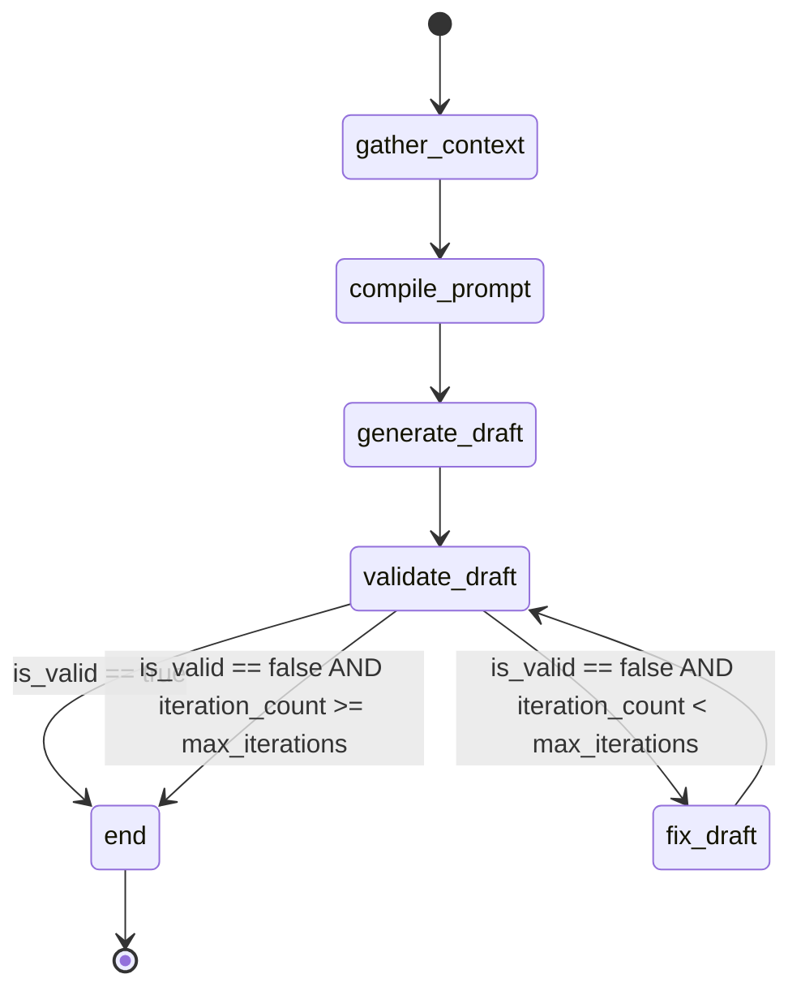
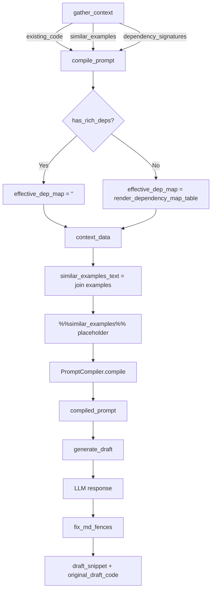

# Flow Control — Orka Surgery Graph

This document contains Mermaid diagrams showing the state machines and control flow for Orka's LangGraph-based surgery pipeline.

## Surgery Graph State Machine

The surgery graph is a deterministic state machine (not a ReAct agent) that enforces strict ordering: `gather_context -> compile_prompt -> generate_draft -> validate_draft -> fix_draft`.



## Node Responsibilities

### gather_context
- Extract target method source via `extract_method_source()`
- Extract class context via `extract_class_source()`
- Query ChromaDB for `similar_examples` (self-exclusion filtered)
- Extract `dependency_signatures` from Graph DB (full signatures + docstrings)
- Backup target file

### compile_prompt
- Load template (`refactor.yaml` or `test.yaml`)
- Resolve injection rules via `resolve_rules()`
- Analyze signature via LibCST
- Build dependency map and caller constraints from Graph DB
- **Prompt layout enforcement:**
  - `similar_examples` rendered inline via `%%similar_examples%%` (above final instruction)
  - `dependency_map` suppressed when `dependency_signatures` present (conditional redundancy)
- Compile via `PromptCompiler.compile(template, rules, context_data)`

### generate_draft
- Send `compiled_prompt` to LLM
- Sanitize response via `fix_md_fences()` (strip markdown code blocks)
- Save to both `draft_snippet` and `original_draft_code` (baseline preservation)
- Increment `iteration_count`

### validate_draft
- **Gate 1:** AST parse validation via `validate_code_snippet()`
- **Gate 2:** Pytest validation (if `test_file_target` set)
- Populate `validation_output` and `is_valid`
- Set `fatal_error` if unrecoverable

### fix_draft
- Load failed `draft_snippet` + `validation_output` + `original_draft_code`
- Compile fix prompt with error context
- Send to LLM for repair
- Update `draft_snippet` (preserve `original_draft_code`)
- Increment `iteration_count`

## Data Flow: Prompt Compilation



## Routing Logic (validate_draft → end | fix_draft)

```python
def _router(state: SurgeryState) -> str:
    if state['is_valid']:
        return 'end'
    
    if state['iteration_count'] >= state['max_iterations']:
        return 'end'  # Give up, rollback
    
    return 'fix_draft'  # Retry with error context
```

The router enforces a bounded retry loop: if validation fails and we haven't exceeded `max_iterations`, route to `fix_draft` for LLM repair. Otherwise, route to `end` (which triggers rollback in `_terminal_node`).
